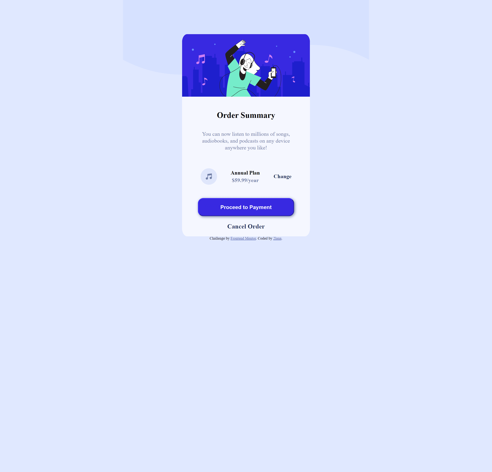

# Frontend Mentor - Order summary card solution

This is a solution to the [Order summary card challenge on Frontend Mentor](https://www.frontendmentor.io/challenges/order-summary-component-QlPmajDUj). Frontend Mentor challenges help me improve my coding skills by building realistic projects. 

## Table of contents

- [Overview](#overview)
  - [The challenge](#the-challenge)
  - [Screenshot](#screenshot)
  - [Links](#links)
- [My process](#my-process)
  - [Built with](#built-with)
  - [What I learned](#what-i-learned)
  - [Continued development](#continued-development)
  - [Useful resources](#useful-resources)
- [Author](#author)
- [Acknowledgments](#acknowledgments)

## Overview

### The challenge

Users should be able to:

- See hover states for interactive elements

### Screenshot





### Links

- Solution URL: [Add solution URL here](https://your-solution-url.com)
- Live Site URL: [Add live site URL here](https://your-live-site-url.com)

## My process

### Built with

- Semantic HTML5 markup
- CSS custom properties
- Flexbox
- CSS Grid
- Mobile-first workflow
- [Styled Components](https://styled-components.com/) - For styles


### What I learned

I learned elementary of semantic HTML5 markup, CSS custom properties, flexbox, grid, media queries, optimal layout depending on device's screen size, hover and focus states for interactive elements:

```html
     <button>
          <a href="#" target="_blank" class="proceed-payment"><h3>Proceed to Payment</h3></a>
      </button>
```
```css
button {
    background-color: var(--bright-blue); 
    border-color: var(--bright-blue);
    box-shadow: 2px 2px 8px var(--desaturated-blue);
    color: var(--very-pale-blue);
    font-weight:400; 
    padding:0 4rem; 
    border-radius: 1rem;
    width: 100%;
}

button:hover {
    background-color: var(--medium-slate-blue);
}
```

### Continued development

I want to continue focusing on in future projects. These could be concepts still not completely comfortable with or techniques  found useful that  want to refine and perfect.


### Useful resources

- [slack](https://app.slack.com/) - This is community best practics
- [frontendmentor](https://www.frontendmentor.io/) - This resource gives me the opportunities to learn more about the use frontend and real practice code simple challenges for beginners. Respect!
- [freecodecamp](https://www.freecodecamp.org/) - This recource helped me learn to code
- [developer.mozilla](https://developer.mozilla.org) - This helped me as resourses for developers by developers.
- [w3schools](https://www.w3schools.com/) - This is an amazing resource which helped me better understand html, css. I'd recommend it to anyone still learning technical concept.
- [screen resolution simulator](https://searchenginereports.net/screen-resolution-simulator) - This is an amazing resource which helped me. 
- [Chrome DevTools](https://developer.chrome.com/docs/devtools/console/) - This recource help me testing html and css.
- [W3C](https://validator.w3.org/) - This recource help me checks the markup validity of Web documents in HTML and CSS.
- [docs.github](https://docs.github.com/en/get-started) - This recource helped me try to understand githab for the first time in my life. I created three repositories, two folders and deleted them several times, it’s a nightmare.

Most YouTube channels represent the author’s personal point of view. Only documentation should be examined.

## Author

- Website - [Add your name here](https://www.your-site.com)
- Frontend Mentor - [@y2Lana](https://www.frontendmentor.io/profile/2lana)


## Acknowledgments

Only practice

Grateful for reading and reply to every constructive comment.